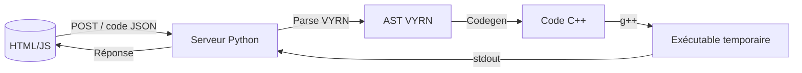

# VYRN — Langage de programmation expérimental

---

## Table des matières

- [Présentation](#présentation)
- [Fonctionnalités](#fonctionnalités-principales)
- [Installation](#installation)
- [Utilisation](#utilisation)
- [Langage VYRN — Documentation](#langage-vyrn--documentation)
- [Architecture technique](#architecture-technique)
- [Contribuer](#contribuer)
- [Roadmap](#roadmap)
- [Licence](#licence)

---

## Présentation

**VYRN** est un langage de programmation expérimental, minimaliste et typé, exécuté via un serveur Python et compilé en C++.
Il inclut une interface web interactive, un parseur personnalisé, et un moteur de génération de code C++ sans bibliothèques externes.

Le but est de créer un environnement de développement et un langage de **zéro**, pour l’apprentissage et l’exploration.

---

## Fonctionnalités principales

- **Éditeur Web** intégré avec coloration syntaxique
- **Types supportés** : int, float, string, bool
- **Déclarations via** ```let``` (variables) et ```const``` (constantes)
- **Références** : possibilité de déclarer une variable/constante par référence à une autre
- **Affectation** avec vérification stricte du type
- **Fonction** ```log()``` avec chaîne ou variable
- **Inférence de type** dans les expressions
- **Compilation C++** transparente via ```g++```
- **Sortie affichée dynamiquement dans l'IDE**

---

## Installation

### Prérequis

- Python 3.x
- Navigateur web moderne (Chrome, Firefox, Edge)
- **Compilateur C++** (```g++```) dans le PATH

### Étapes

1. **Cloner le dépôt** ou télécharger les fichiers sources :

   ```bash
   git clone https://github.com/arthur10o/VYRN.git
   cd VYRN
2. **Lancer le serveur Python :**
   ```bash
   python3 app.py
3. Ouvrir l’IDE dans le navigateur :
   ```bash
   http://localhost:5500

---

## Utilisation
1. Ecrire du code VYRN dans l'éditeur
2. Cliquer sur **Exécuter**
3. Le code est parsé, transformé en C++, compilé puis exécuté
4. La sortie ou les erreurs s’affichent en bas

---

## Langage VYRN — Documentation
### Commandes disponibles
| Syntaxe | Description | Exemple |
| - | - | - |
| `log("texte");` | Affiche du texte | `log("Hello");` |
| `let int x = 42;` | Variable typée | `let string nom = "Bob";` |
| `const float PI = 3.14;` | Constante non modifiable | `const int ANSWER = 42;` |
| `let type a = b;` | Déclaration par référence | `let type copie = age;` |
| `x = 12;` | Réaffectation (même type obligatoire) | `nom = "Alice";` |

### Types supportés
- ```int``` : entiers
- ```float``` : nombres à virgule(64bits)
- ```string``` : texte entre ```"..."``` ou ```'...'```
- ```bool``` : ```true``` ou ```false```

### Exemples
```vyrn
let int a = 10;
let int b = 20;

const float pi = 3.1415;

let string txt = "Résultat: ";
let bool declare = true;

log(b);
log(declare);
log(pi);
```
### Limitations actuelles
- Aucune structure de contrôle (if, while, etc.)
- Les fonctions ne sont pas encore disponibles
- Une seule expression par ligne (pas d’imbrication complexe)
- Gestion basique des erreurs (message d'erreur retourné tel quel)
- Les opérateurs logiques (&&, ||, !) ne sont pas encore pris en charge

## Architecture technique

### Description des composants
- Frontend (HTML/CSS/JS) :
  - Éditeur web en HTML/CSS/JS :
     - Envoie le code via requêtes POST JSON au serveur.
     - Gère la coloration syntaxique dynamique en temps réel (highlighting personnalisé sans bibliothèque externe).
- Serveur Python :
  - Service HTTP simple (http.server)
  - Parse le code VYRN, génère du code C++ correspondant.
  - Compile le C++ avec g++ en exécutable temporaire.
  - Exécute le binaire et récupère la sortie pour la renvoyer.
- Compilation & Exécution :
  - Création de fichiers temporaires temp.cpp et temp_exec.exe (Windows).

### Structure des fichiers
```bash
/project-root
│
├── frontend/
│   ├── index.html                # Page principale de l'IDE
│   ├── styles.css                # Styles CSS de l'éditeur
│   ├── main.js                   # Gestion de l'éditeur : récupération du code, coloration syntaxique
│
├── backend/
│   ├── server.py                 # Mini serveur HTTP Python (reçoit JSON, transmet au C++)
│   ├── parser/                   # Parser et génération code C++
│   │   ├── ast_parser.cpp        # Parseur AST en C++
│   │   ├── code_generator.cpp    # Génération/interprétation du code
│   │   ├── parser_exec.exe       # Le fichier exécutable généré par le c++
│
├── communication/
│
└── README.md
```

## Contribuer
Contributions bienvenues !
Merci de :
- Ouvrir une issue pour discuter des idées ou bugs
- Proposer des pull requests claires avec tests et documentation
- Respecter la structure et la syntaxe existantes
- Ajouter des fonctionnalités progressivement

## Roadmap
- ✅ Gestion des types (int, float, string, bool)
- ✅ Références entre variables / constantes
- ✅ Coloration syntaxique personnalisée
- ☐ Expressions arithmétiques simples et concaténation
- ☐ Opérateurs logiques (&&, ||, !)
- ☐ Structures de contrôle (if, while, for)
- ☐ Fonctions (déclaration + appel)
- ☐ Système de modules / fichiers externes
- ☐ Refactoring du parser (arbre plus robuste)
- ☐ Interface web améliorée (erreurs ligne par ligne)

  ## Licence

Ce projet est distribué sous les termes de la **GNU General Public License v3.0 (GPL-3.0)**.  
Cela signifie que vous êtes libre de :

- **Utiliser** ce logiciel pour tout usage,
- **Étudier** et **modifier** le code source,
- **Partager** des copies du logiciel,
- **Distribuer** vos propres versions, à condition qu'elles soient également sous licence GPL-3.0.

Toute modification ou redistribution du projet doit rester sous la même licence, et le **code source doit être fourni** ou rendu accessible.

Consultez le fichier [`LICENSE`](LICENSE) pour le texte complet de la licence.
Pour plus d'informations, vous pouvez aussi visiter :  

---

Merci d’avoir testé VYRN !
