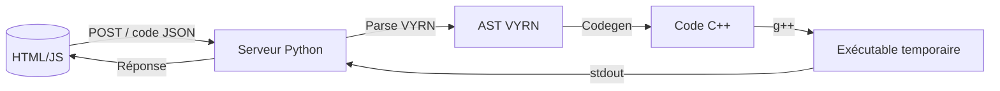

# VYRN — Langage de programmation expérimental

---

## Table des matières

- [Présentation](#présentation)
- [Fonctionnalités](#fonctionnalités-principales)
- [Installation](#installation)
- [Utilisation](#utilisation)
- [Langage VYRN — Documentation](#langage-vyrn--documentation)
- [Architecture technique](#architecture-technique)
- [Contribuer](#contribuer)
- [Roadmap](#roadmap)
- [Licence](#licence)

---

## Présentation

**VYRN** est un langage de programmation expérimental, minimaliste et typé, exécuté via un serveur Python et compilé en C++.
Il inclut une interface web interactive, un parseur personnalisé, et un moteur de génération de code C++ sans bibliothèques externes.

Le but est de créer un environnement de développement et un langage de **zéro**, pour l’apprentissage et l’exploration.

---

## Fonctionnalités principales

- **Éditeur Web** intégré avec coloration syntaxique
- **Types supportés** : int, float, string, bool
- **Déclarations via** `let` (variables) et `const` (constantes)
- **Références** : possibilité de déclarer une variable/constante par référence à une autre
- **Affectation** avec vérification stricte du type
- **Fonction** `log()` avec chaîne ou variable
- **Opérations arithmétiques** : addition, soustraction, multiplication, division, modulo, racine carrée (`+`, `-`, `*`, `/`, `%`, `sqrt()`)
- **Inférence de type** dans les expressions
- **Compilation C++** transparente via `g++`
- **Sortie affichée dynamiquement dans l'IDE**

---

## Installation

### Prérequis

- Python 3.x
- Navigateur web moderne (Chrome, Firefox, Edge)
- **Compilateur C++** (`g++`) dans le PATH

### Étapes

1. **Cloner le dépôt** ou télécharger les fichiers sources :

   ```bash
   git clone https://github.com/arthur10o/VYRN.git
   cd VYRN
2. **Lancer le serveur Python :**
   ```bash
   python3 app.py
3. Ouvrir l’IDE dans le navigateur :
   ```bash
   http://localhost:5500

---

## Utilisation
1. Écrire du code VYRN dans l'éditeur
2. Cliquer sur **Exécuter**
3. Le code est parsé, transformé en C++, compilé puis exécuté
4. La sortie ou les erreurs s’affichent en bas

---

## Langage VYRN — Documentation
### Commandes disponibles
| Syntaxe | Description | Exemple |
| - | - | - |
| `log("texte");` | Affiche du texte | `log("Hello");` |
| `let int x = 42;` | Variable typée | `let string nom = "Bob";` |
| `const float PI = 3.14;` | Constante non modifiable | `const int ANSWER = 42;` |
| `let type a = b;` | Déclaration par référence | `let type copie = age;` |
| `x = 12;` | Réaffectation (même type obligatoire) | `nom = "Alice";` |
| `let int y = 2 + 3 * 4;` | Opérations mathématiques | `let float r = sqrt(16) + 1.5;` |

### Types supportés
- `int` : entiers (opérations arithmétiques supportées)
- `float` : nombres à virgule (64bits, opérations arithmétiques supportées)
- `string` : texte entre `"..."` ou `'...'`
- `bool` : `true` ou `false`

### Exemples
```vyrn
let int a = 10;
let int b = 20;
let int somme = a + b;
let int produit = a * b;
let float division = b / 3.0;
let int modulo = b % 7;
let float racine = sqrt(49);

const float pi = 3.1415;

let string txt = "Résultat: ";
let bool declare = true;

log(somme);
log(produit);
log(division);
log(modulo);
log(racine);
log(declare);
log(pi);
```
### Limitations actuelles
- Aucune structure de contrôle (if, while, etc.)
- Les fonctions ne sont pas encore disponibles
- Une seule expression par ligne (pas d’imbrication complexe)
- Gestion basique des erreurs (message d'erreur retourné tel quel)
- Les opérateurs logiques (&&, ||, !) ne sont pas encore pris en charge

## Architecture technique

### Description des composants
- **Frontend (HTML/CSS/JS)** :
  - Éditeur web en HTML/CSS/JS :
     - Envoie le code via requêtes POST JSON au serveur.
     - Gère la coloration syntaxique dynamique en temps réel (highlighting personnalisé sans bibliothèque externe).
     - Fichiers principaux : `frontend/index.html`, `frontend/style.css`, `frontend/main.js`.
- **Serveur Python** :
  - Fichier principal : `backend/server.py`
  - Service HTTP simple (http.server)
  - Reçoit le code, l’écrit dans `communication/input_code.txt`, puis appelle le binaire C++ (`parser_exec.exe`).
  - Récupère la sortie ou les erreurs et les renvoie au frontend.
- **Compilation & Exécution** :
  - Génération de code C++ dans `communication/generated_code.cpp`.
  - Compilation avec `g++` en `parser_exec.exe` (Windows).
  - Exécution du binaire, sortie dans `communication/program_output.txt`.

### Structure des fichiers
```bash
/project-root
│
├── frontend/
│   ├── index.html                # Page principale de l'IDE
│   ├── style.css                 # Styles CSS de l'éditeur
│   ├── main.js                   # Gestion de l'éditeur : récupération du code, coloration syntaxique
│
├── backend/
│   ├── server.py                 # Mini serveur HTTP Python (reçoit JSON, transmet au C++)
│   ├── parser/                   # Parser et génération code C++
│   │   ├── ast_parser.hpp        # Définition AST et parseur
│   │   ├── code_generator.cpp    # Génération/interprétation du code
│   │   ├── parser_exec.exe       # Le fichier exécutable généré par le C++
│
├── communication/
│   ├── input_code.txt            # Code VYRN reçu du frontend
│   ├── generated_code.cpp        # Code C++ généré
│   ├── program_output.txt        # Sortie du programme exécuté
│   ├── compile_errors.txt        # Erreurs de compilation éventuelles
│   ├── parsing_errors.txt        # Erreurs de parsing éventuelles
│
├── LICENSE
└── README.md
```
### Future architecture :
```bash
├── ide/                            # Composants de l'IDE
│   ├── main.cpp                    # Point d’entrée du programme (IDE principal)
│   ├── ui.cpp / ui.hpp             # Interface utilisateur (terminal avec ncurses ou GUI Qt)
│   ├── editor.cpp / editor.hpp     # Éditeur de texte, gestion de fichiers, coloration syntaxique simple
│
├── compiler/                       # Compilation et exécution du langage
│   ├── lexer.cpp / lexer.hpp       # Analyse lexicale (tokenisation)
│   ├── parser.cpp / parser.hpp     # Analyse syntaxique (création AST)
│   ├── ast.hpp                     # Structures de l’AST
│   ├── codegen.cpp / codegen.hpp   # Génération ou exécution du code (C++ ou interprété)
│   ├── runtime.cpp / runtime.hpp   # Fonctions natives (log, sqrt, etc.)
|   ├── error.hpp
│
├── stdlib/                         # Fonctions de base du langage (implémentations natives ou wrappers)
│   ├── math.vyrn                   # ex: sqrt, pow
│   ├── io.vyrn                     # ex: log
│
├── tests/                          # Tests unitaires ou exemples
│   ├── example1.vyrn               # Le fichier que tu as fourni
│   └── example2.vyrn               # Autres cas à tester
│
├── bin/                            # Binaires générés
│   ├── vyrn_ide                    # L'IDE compilé
│   ├── vyrn_exec                   # Moteur d'exécution (optionnel si séparé)
│
├── doc/                            # Documentation du langage
│   ├── syntax.md                   # Règles de syntaxe
│   ├── types.md                    # Types supportés
│   └── fonctions.md                # Fonctions natives
│
├── LICENSE
└── README.md
```

## Contribuer
Contributions bienvenues !
Merci de :
- Ouvrir une issue pour discuter des idées ou bugs
- Proposer des pull requests claires avec tests et documentation
- Respecter la structure et la syntaxe existantes
- Ajouter des fonctionnalités progressivement

## Roadmap
- ✅ Gestion des types (int, float, string, bool)
- ✅ Références entre variables / constantes
- ✅ Coloration syntaxique personnalisée
- ✅ Expressions arithmétiques simples
- ☐ Opérateurs logiques (&&, ||, !)
- ☐ Structures de contrôle (if, while, for)
- ☐ Fonctions (déclaration + appel)
- ☐ Système de modules / fichiers externes
- ☐ Refactoring du parser (arbre plus robuste)
- ☐ Interface web améliorée (erreurs ligne par ligne)

  ## Licence

Ce projet est distribué sous les termes de la **GNU General Public License v3.0 (GPL-3.0)**.  
Cela signifie que vous êtes libre de :

- **Utiliser** ce logiciel pour tout usage,
- **Étudier** et **modifier** le code source,
- **Partager** des copies du logiciel,
- **Distribuer** vos propres versions, à condition qu'elles soient également sous licence GPL-3.0.

Toute modification ou redistribution du projet doit rester sous la même licence, et le **code source doit être fourni** ou rendu accessible.

Consultez le fichier [`LICENSE`](LICENSE) pour le texte complet de la licence.
Pour plus d'informations, vous pouvez aussi visiter :  

---

Merci d’avoir testé VYRN !
