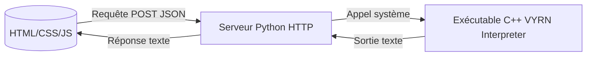

# VYRN — Langage de programmation expérimental

---

## Table des matières

- [Présentation](#présentation)  
- [Fonctionnalités](#fonctionnalités-principales)
- [Installation](#installation)  
- [Utilisation](#utilisation)  
- [Langage VYRN — Documentation](#langage-vyrn--documentation)  
- [Architecture technique](#architecture-technique)  
- [Contribuer](#contribuer)  
- [Roadmap](#roadmap)  
- [Licence](#licence)  

---

## Présentation

**VYRN** est un langage de programmation expérimental, accompagné d’un environnement web léger permettant d’écrire et d’exécuter du code en temps réel.  
Le projet combine un IDE web (HTML/CSS/JS), un serveur Python pour interpréter les requêtes, et un exécutable C++ pour traiter les instructions du langage.

Le but est d’explorer la création d’un langage et de son environnement complet, avec un contrôle total et sans bibliothèques externes complexes.

---

## Fonctionnalités principales

- **Éditeur Web Intégré** : Interface simple pour écrire, exécuter et afficher les résultats.  
- **Langage VYRN** : Syntaxe minimaliste, commandes simples (actuellement `print`).  
- **Backend Python** : Serveur HTTP léger pour interpréter et transmettre les commandes.  
- **Interpréteur C++** : Programme natif pour l’exécution réelle des instructions.  
- **Communication via JSON** entre le frontend et le backend.  
- **Arrêt automatique du serveur** après l’exécution pour simplifier le cycle.

---

## Installation

### Prérequis

- Python 3.x  
- Navigateur web moderne (Chrome, Firefox, Edge)  
- (Optionnel) Compilateur C++ pour développer l'interpréteur
- Assurez-vous que `g++` est dans votre PATH (MinGW pour Windows ou GCC sous Linux/macOS).

### Étapes

1. **Cloner le dépôt** ou télécharger les fichiers sources :

   ```bash
   git clone https://github.com/arthur10o/VYRN.git
   cd VYRN

2. **Lancer le serveur Python :**
   ```bash
   python3 app.py
3. Ouvrir l’IDE dans le navigateur :
   ```bash
   http://localhost:5500

---

## Utilisation
1. Ecrire du code VYRN dans l'éditeur
2. Cliquer sur Exécuter
3. Visualiser la sortie dans la console de résultat
4. - Le serveur **reste actif** après exécution.
   - L’arrêt automatique a été désactivé pour faciliter les tests successifs.

---

## Langage VYRN — Documentation
### Syntaxe de base
| Commande        | Description                      | Exemple                 | Sortie                 |
|----------------|----------------------------------|-------------------------|-------------------------|
| `print("texte");` | Affiche une chaîne de caractères | `print("Hello, World!");` |```Hello, World!``` |

- Les chaines doivent être entre guillemets doubles ```" "```
- Les espaces sont obligatoires après la commande ```print```
- Les commandes non reconnues retournes une erreur

### Exemples
```vy
print("Bienvenue sur VYRN");
print("Une autre ligne");
```

### Limitations actuelles
- Seule la commande ```print``` est prise en charge.
- Pas de variables, boucles ou conditions pour l'instant.
- L'interpréteur est basique.

---


## Architecture technique

### Description des composants
- Frontend :
    - Éditeur de code (textarea)
    - Bouton exécution déclenchant une requête POST à la racine ```/```
    - Affichage des résultats
- Serveur Python :
    - Service HTTP minimaliste (```http.server```)
    - Gère les requêtes GET (fichiers statiques) et POST (```/run```)
    - Parse le JSON envoyé, appelle l’exécutable C++ avec les arguments reçus
    - Retourne la sortie du programme au frontend
- Interpréteur C++ :
    - Exécutable natif
    - Lit l’argument
    - Retourne le résultat ou message d’erreur

---

## Contribuer
Contributions bienvenues !
Merci de :
- Ouvrir une issue pour discuter des idées ou bugs
- Proposer des pull requests claires avec tests et documentation
- Respecter la structure et la syntaxe existantes
- Ajouter des fonctionnalités progressivement

---

## Roadmap
- [x] IDE web simple (HTML/CSS/JS)
- [x] Serveur Python minimal
- [x] Interpréteur C++ pour `print`
- [ ] Gestion des variables et expressions
- [ ] Structures de contrôle (conditions, boucles)
- [ ] Mode serveur persistant sans arrêt automatique
- [ ] Amélioration du parsing et gestion d’erreurs avancée
- [ ] Documentation utilisateur détaillée
- [ ] Tests automatisés

---

## Licence

Ce projet est distribué sous les termes de la **GNU General Public License v3.0 (GPL-3.0)**.  
Cela signifie que vous êtes libre de :

- **Utiliser** ce logiciel pour tout usage,
- **Étudier** et **modifier** le code source,
- **Partager** des copies du logiciel,
- **Distribuer** vos propres versions, à condition qu'elles soient également sous licence GPL-3.0.

Toute modification ou redistribution du projet doit rester sous la même licence, et le **code source doit être fourni** ou rendu accessible.

Consultez le fichier [`LICENSE`](LICENSE) pour le texte complet de la licence.
Pour plus d'informations, vous pouvez aussi visiter :  

---

Merci d’avoir testé VYRN !
