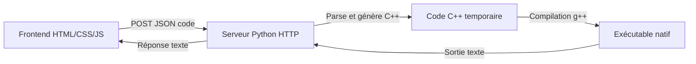

# VYRN — Langage de programmation expérimental

---

## Table des matières

- [Présentation](#présentation)  
- [Fonctionnalités](#fonctionnalités-principales)
- [Installation](#installation)  
- [Utilisation](#utilisation)  
- [Langage VYRN — Documentation](#langage-vyrn--documentation)  
- [Architecture technique](#architecture-technique)  
- [Contribuer](#contribuer)  
- [Roadmap](#roadmap)  
- [Licence](#licence)  

---

## Présentation

**VYRN** est un langage de programmation expérimental, accompagné d’un environnement web léger permettant d’écrire et d’exécuter du code en temps réel.  
Le projet combine un IDE web (HTML/CSS/JS), un serveur Python pour interpréter les requêtes, et un exécutable C++ pour traiter les instructions du langage.

Le but est d’explorer la création d’un langage et de son environnement complet, avec un contrôle total et sans bibliothèques externes complexes.

---

## Fonctionnalités principales

- **Éditeur Web Intégré** :  Interface web simple pour écrire, envoyer et afficher les résultats du code.
- **Langage VYRN** : Syntaxe minimaliste avec support des types bool, string, float et int, variables (`let`), constantes (`const`) et affichage (`print`).
- **Support des références** : possibilité de déclarer une variable ou constante par référence à une autre variable existante.
- **Coloration syntaxique** : L’éditeur web colore dynamiquement les types, fonctions, variables, constantes, chaînes, booléens et commentaires.
- **Backend Python** : Serveur HTTP basé sur ```http.server``` qui parse le code, génère du C++ puis compile et exécute ce dernier.
- **Interpréteur C++** : Le serveur écrit un fichier ```.cpp``` temporaire, compile avec ```g++``` et exécute le binaire pour récupérer la sortie.
- **Communication via requêtes HTTP** (GET pour l’interface, POST pour exécuter le code).
- **Pas d’arrêt automatique du serveur**, pour un usage continu.

---

## Installation

### Prérequis

- Python 3.x  
- Navigateur web moderne (Chrome, Firefox, Edge)  
- (Optionnel) Compilateur C++ (`g++`) pour développer l'interpréteur  
- Assurez-vous que `g++` est dans votre PATH (MinGW pour Windows ou GCC sous Linux/macOS).

### Étapes

1. **Cloner le dépôt** ou télécharger les fichiers sources :

   ```bash
   git clone https://github.com/arthur10o/VYRN.git
   cd VYRN
2. **Lancer le serveur Python :**
   ```bash
   python3 app.py
3. Ouvrir l’IDE dans le navigateur :
   ```bash
   http://localhost:5500

---

## Utilisation
1. Ecrire du code VYRN dans l'éditeur
2. Cliquer sur **Exécuter** pour envoyer le code au serveur.
3. Visualiser la sortie ou les erreurs dans la console de résultats intégrée.
4. Le serveur **reste actif** après exécution.

---

## Langage VYRN — Documentation
### Syntaxe de base
| Commande             | Description                               | Exemple                   | Sortie           |
| -------------------- | ----------------------------------------- | ------------------------- | ---------------- |
| `print("texte");`    | Affiche une chaîne de caractères          | `print("Hello, World!");` | `Hello, World!`  |
| `print(variable);`   | Affiche la valeur d’une variable          | `print(age);`             | `30`             |
| `let nom = valeur;`  | Déclare une variable typée                | `let age = 30;`           | Variable stockée |
| `nom = valeur_deux;` | Affecte une nouvelle valeur (même type)   | `age = 32;`               | Variable stockée |
| `const nom = valeur;`| Déclare une constante typée               | `const pi = 3.14;`        | Constante stockée|

- Types supportés : ```string``` (texte entre guillemets doubles ou simples), ```bool``` (```true```/```false```), ```int``` (entiers), ```float``` (nombres à virgule).
- Variables et constantes doivent être typées implicitement selon la valeur assignée à la déclaration.
- Lors d’une réaffectation (```x = 12.5;```), le type doit correspondre exactement au type d'origine.
- Les constantes ne peuvent pas être réassignées.
- Les commentaires ```//``` sont supportés en début et en fin de ligne.
- Toute commande inconnue ou mal formée retourne une erreur.
- Les erreurs de type à l’assignation provoquent une erreur d’exécution.

### Exemples
```js
// Déclaration de variables
let a = 10;
const b = 20;
let c = a;
const d = b;

// Déclaration de variables de types différents
let pi = 3.1415;
const isActive = true;
let message = "Hello, World!";
const greeting = message;

// Affichage des valeurs initiales
print("Valeurs initiales:");
print(a);
print(b);
print(c);
print(d);
print(pi);
print(isActive);
print(message);
print(greeting);

// Assignation
a = 15;
c = a;
message = "Nouvelle valeur";

// Affichage après assignation
print("Valeurs après assignation:");
print(a);
print(c);
print(message);

// Affichage finale
print("Fin du programme");
```

### Limitations actuelles
- Commandes supportées : `print`, déclaration et assignation de variables via `let` et `=`, déclaration de constantes avec `const`.
- Types supportés : `bool`, `string`, `int`, `float`.
- Pas encore de structures de contrôle (conditions, boucles, fonctions).
- Variables et constantes typées implicitement selon la valeur assignée à la déclaration.
- Les constantes ne peuvent pas être réassignées.
- Lors d’une réaffectation (```x = 12.5;```), le type doit correspondre exactement au type d'origine.
- Pas de gestion d’erreurs avancée autre que syntaxique et de type (erreurs runtime non gérées).
- Pas encore de support pour les commentaires multi-lignes.
- Pas de support pour les expressions complexes ou opérations arithmétiques/logiques.


---


## Architecture technique


### Description des composants
- Frontend (HTML/CSS/JS):
   + Éditeur web en HTML/CSS/JS :
   +   - Envoie le code via requêtes POST JSON au serveur.
   +   - Gère la coloration syntaxique dynamique en temps réel (highlighting personnalisé sans bibliothèque externe).
- Serveur Python :
    - Service HTTP simple (```http.server```)
    - Parse le code VYRN, génère du code C++ correspondant.
    - Compile le C++ avec ```g++``` en exécutable temporaire.
    - Exécute le binaire et récupère la sortie pour la renvoyer.
- Compilation & Exécution :
    - Création de fichiers temporaires ```temp.cpp``` et ```temp_exec.exe``` (Windows).
    - Nettoyage automatique des fichiers temporaires après exécution.

---

## Contribuer
Contributions bienvenues !
Merci de :
- Ouvrir une issue pour discuter des idées ou bugs
- Proposer des pull requests claires avec tests et documentation
- Respecter la structure et la syntaxe existantes
- Ajouter des fonctionnalités progressivement

---

## Roadmap
- [x] IDE web simple (HTML/CSS/JS)
- [x] Serveur Python minimal
- [x] Parsing basique du langage VYRN
- [x] Génération et compilation dynamique du C++
- [x] Gestion des variables typées et ```print```
- [x] Ajout du support des constantes (`const`)
- [x] Coloration syntaxique côté client
- [x] Ajouter le support des références dans les déclarations  
- [x] Vérifier strictement le type lors des affectations  
- [x] Gérer les erreurs de référence et de typage  
- [ ] Ajout de structures de contrôle (conditions, boucles)
- [ ] Amélioration de la gestion des erreurs
- [ ] Support des fonctions et modules
- [ ] Tests automatisés et documentation utilisateur complète

---

## Licence

Ce projet est distribué sous les termes de la **GNU General Public License v3.0 (GPL-3.0)**.  
Cela signifie que vous êtes libre de :

- **Utiliser** ce logiciel pour tout usage,
- **Étudier** et **modifier** le code source,
- **Partager** des copies du logiciel,
- **Distribuer** vos propres versions, à condition qu'elles soient également sous licence GPL-3.0.

Toute modification ou redistribution du projet doit rester sous la même licence, et le **code source doit être fourni** ou rendu accessible.

Consultez le fichier [`LICENSE`](LICENSE) pour le texte complet de la licence.
Pour plus d'informations, vous pouvez aussi visiter :  

---

Merci d’avoir testé VYRN !
